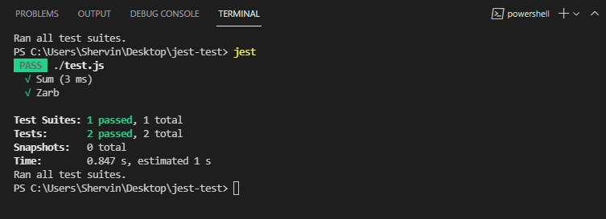

# <p dir="rtl">معرفی یونیت تست با jest</p>

<div dir="rtl">



در این شاخه از این ریپوسیتوری طبق انچه در سایت [jestjs.io](https://jestjs.io) آمده یک تست گرفته شده است. 

نکته جالب این بود که اولش بجای `test.js` نوشته بودم `index.js` بخاطر همین هی ارور میداد. توجه کنید حتما اسمشو تست بذارین! :smile:
</div>

```
yarn  global add jest 
yarn add --dev jest
yarn test
jest
```